# 🎬 Online Movie Seat Booking Website

An **Online Movie Seat Booking Website** developed using **Advanced Java, JSP, Servlets, JDBC, and MySQL**. The system allows users to browse movies, view movie details and shows, select available seats, make bookings, complete payments, and manage their bookings.

The project also provides an **Admin Module** for managing movies, shows, users, bookings, and payments.

---

## 📌 Project Overview

The **Online Movie Seat Booking Website** is a web-based application designed to simplify the movie ticket booking process.

Users can:

- Create an account and log in
- Browse available movies
- View movie details
- View available shows
- Select seats
- View booking summary
- Make payments
- View booking confirmation
- View previous bookings
- Manage profile
- Add movies to wishlist
- Manage shopping cart

Administrators can:

- Log in through the Admin Panel
- View the Admin Dashboard
- Manage movies
- Manage shows
- Manage users
- Manage bookings
- Manage payments

---

## ✨ Features

### 👤 User Module

- User Registration
- User Login
- User Logout
- User Dashboard
- Browse Movies
- Movie Details
- Show Selection
- Seat Selection
- Real-time Seat Availability
- Booking Summary
- Payment
- Booking Confirmation
- My Bookings
- Profile Management
- Wishlist
- Cart
- Contact Page
- About Page
- Settings

### 🛠️ Admin Module

- Admin Login
- Admin Dashboard
- Manage Movies
- Add Movies
- Update Movies
- Delete Movies
- Manage Shows
- Add Shows
- Update Shows
- Delete Shows
- Manage Users
- Manage Bookings
- Manage Payments

### 🎟️ Movie Booking Features

- Movie listing
- Movie details
- Multiple shows
- Seat selection
- Available/blocked/booked seat management
- Booking summary
- Payment processing
- Booking confirmation
- Booking history
- Wishlist functionality
- Cart functionality

---

## 🛠️ Technologies Used

| Technology | Purpose |
|------------|---------|
| **Java** | Backend Programming |
| **JSP** | Dynamic Web Pages |
| **Servlets** | Request and Response Handling |
| **JDBC** | Database Connectivity |
| **MySQL** | Database Management |
| **HTML5** | Page Structure |
| **CSS3** | Styling |
| **JavaScript** | Client-side Functionality |
| **Bootstrap** | Responsive UI Components |
| **Apache Tomcat 9** | Web/Application Server |
| **Eclipse IDE** | Development Environment |

---

## 🏗️ System Architecture

The project follows a layered architecture using JSP, Servlets, DAO, JDBC, and MySQL.

```text
                    ┌──────────────────────┐
                    │         User         │
                    └──────────┬───────────┘
                               │
                               ▼
                    ┌──────────────────────┐
                    │      JSP Pages       │
                    │    User / Admin UI   │
                    └──────────┬───────────┘
                               │
                               ▼
                    ┌──────────────────────┐
                    │       Servlets       │
                    │  Request Processing  │
                    └──────────┬───────────┘
                               │
                               ▼
                    ┌──────────────────────┐
                    │      DAO Layer       │
                    │  Database Operations │
                    └──────────┬───────────┘
                               │
                               ▼
                    ┌──────────────────────┐
                    │         JDBC         │
                    │ Database Connectivity│
                    └──────────┬───────────┘
                               │
                               ▼
                    ┌──────────────────────┐
                    │        MySQL         │
                    │       Database       │
                    └──────────────────────┘
```

---

## 🔄 User Booking Workflow

```text
Home
  ↓
Login / Sign Up
  ↓
User Dashboard
  ↓
Movies
  ↓
Movie Details
  ↓
Select Show
  ↓
Select Seats
  ↓
Booking Summary
  ↓
Payment
  ↓
Booking Confirmed
  ↓
My Bookings
```

---

## 📸 Screenshots

### 🏠 Home Page & Login

<table>
  <tr>
    <td align="center">
      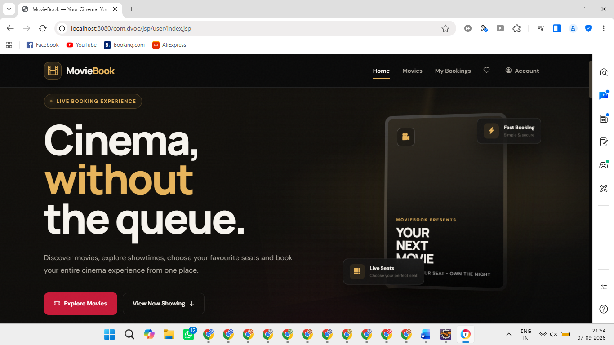
      <br>
      <b>Home Page</b>
    </td>
    <td align="center">
      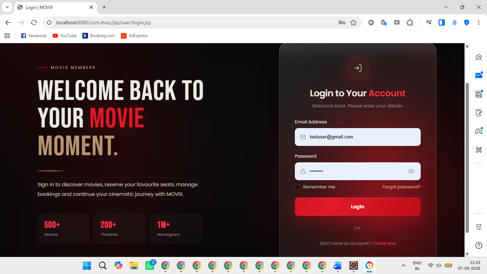
      <br>
      <b>Login Page</b>
    </td>
  </tr>
</table>

### 👤 User Registration & Movies

<table>
  <tr>
    <td align="center">
      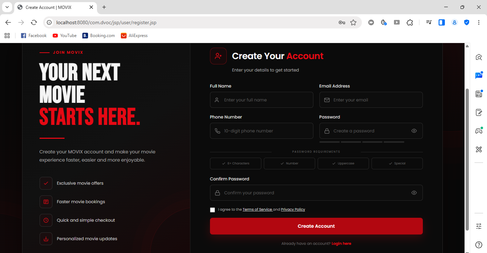
      <br>
      <b>User Registration</b>
    </td>
    <td align="center">
      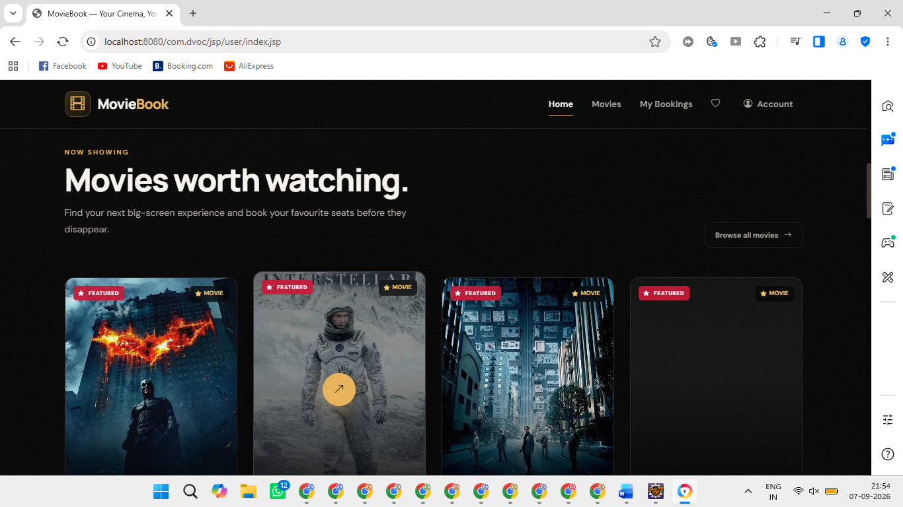
      <br>
      <b>Movies Page</b>
    </td>
  </tr>
</table>

### 🎬 Movies & Movie Details

<table>
  <tr>
    <td align="center">
      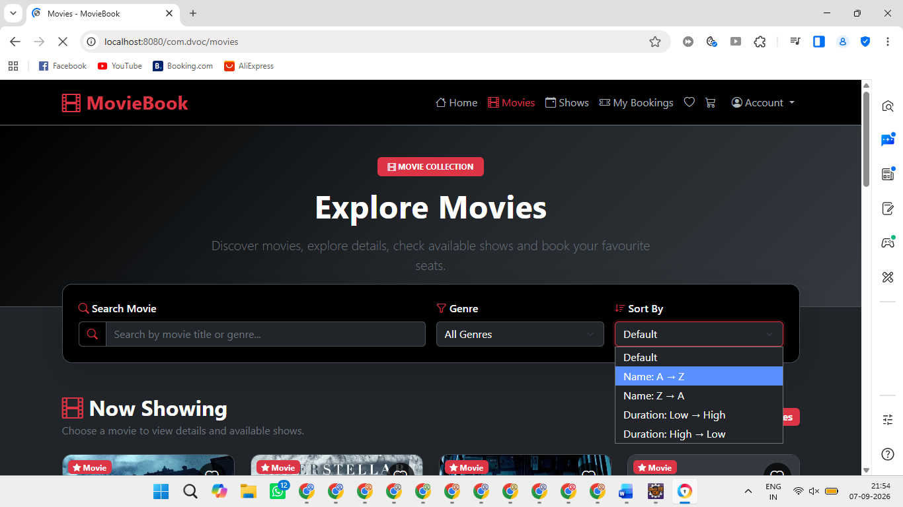
      <br>
      <b>Movies Listing</b>
    </td>
    <td align="center">
      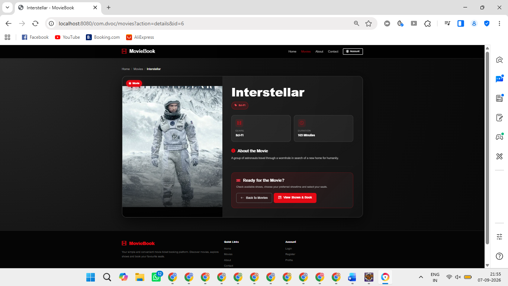
      <br>
      <b>Movie Details</b>
    </td>
  </tr>
</table>

### 🎟️ Show Selection

<table>
  <tr>
    <td align="center">
      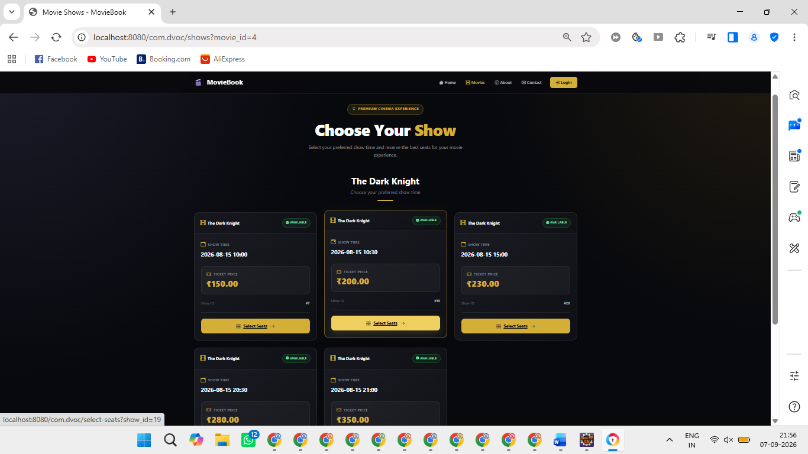
      <br>
      <b>Show Selection</b>
    </td>
  </tr>
</table>

### 💺 Seat Selection

<table>
  <tr>
    <td align="center">
      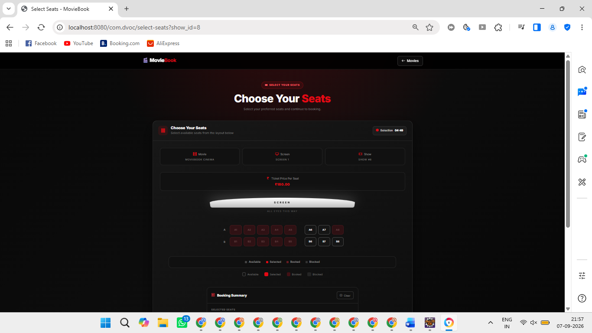
      <br>
      <b>Seat Selection</b>
    </td>
    <td align="center">
      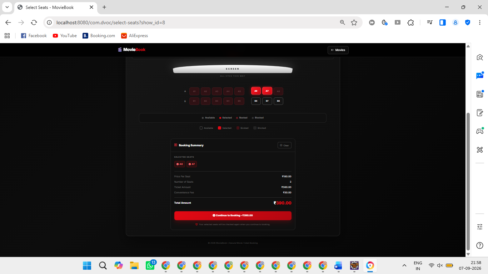
      <br>
      <b>Seat Booking</b>
    </td>
  </tr>
</table>

### 🧾 Booking Summary

<table>
  <tr>
    <td align="center">
      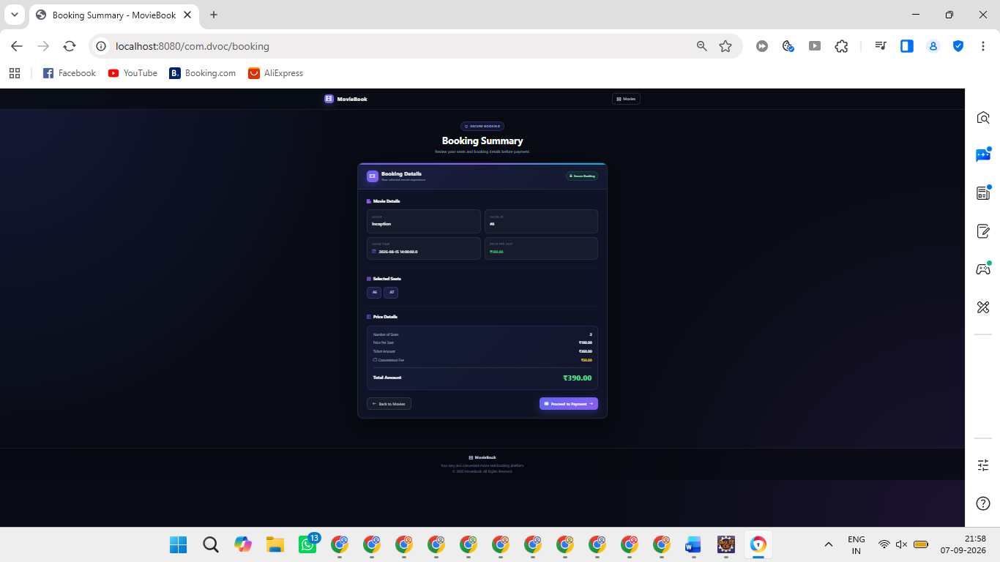
      <br>
      <b>Booking Summary</b>
    </td>
  </tr>
</table>

### 💳 Payment

<table>
  <tr>
    <td align="center">
      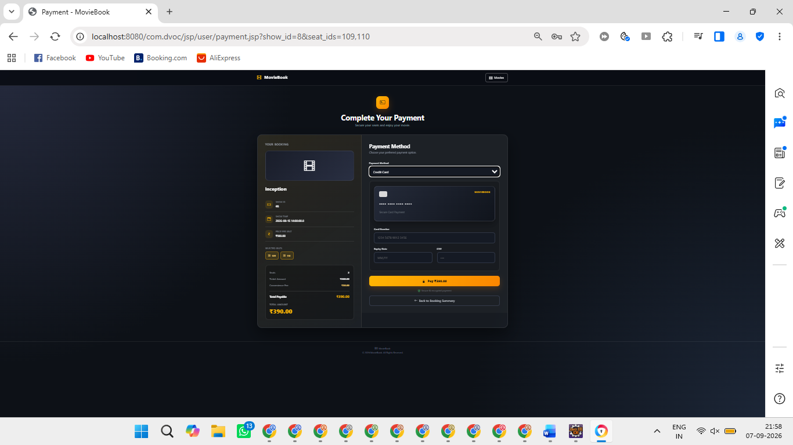
      <br>
      <b>Payment Page</b>
    </td>
  </tr>
</table>

### 📋 My Bookings

<table>
  <tr>
    <td align="center">
      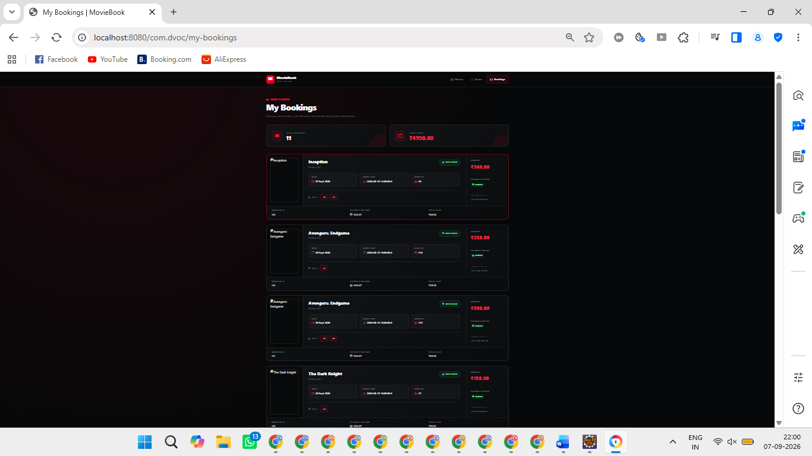
      <br>
      <b>My Bookings</b>
    </td>
  </tr>
</table>

### 👤 Profile

<table>
  <tr>
    <td align="center">
      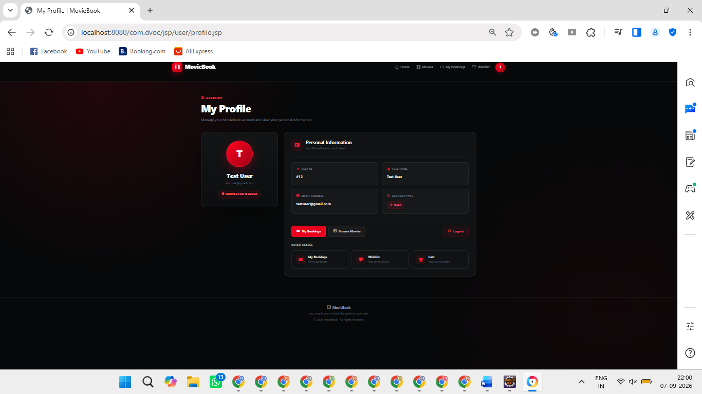
      <br>
      <b>User Profile</b>
    </td>
  </tr>
</table>

---

## 🗄️ Database Design

The application uses MySQL as the relational database.

**Database Name:** `movie_booking`

### Database Tables

| Table | Description |
|-------|-------------|
| `users` | Stores user and admin account information |
| `movies` | Stores movie information |
| `shows` | Stores movie show information |
| `seats` | Stores seat information and availability |
| `bookings` | Stores booking information |
| `booking_seats` | Stores seats associated with bookings |
| `payments` | Stores payment information |
| `cart` | Stores movies/selections added to cart |
| `wishlist` | Stores movies added to user wishlist |

---

## 📂 Project Structure

```text
Online-Movie-Seat-Booking/
│
├── src/
│   ├── com/
│   │   └── moviebooking/
│   │       ├── controller/
│   │       │   ├── AdminServlet.java
│   │       │   ├── BookingServlet.java
│   │       │   ├── CartServlet.java
│   │       │   ├── DashboardServlet.java
│   │       │   ├── LoginServlet.java
│   │       │   ├── LogoutServlet.java
│   │       │   ├── MovieServlet.java
│   │       │   ├── PaymentServlet.java
│   │       │   ├── ProfileServlet.java
│   │       │   ├── RegisterServlet.java
│   │       │   └── WishlistServlet.java
│   │       │
│   │       ├── dao/
│   │       │   ├── BookingDAO.java
│   │       │   ├── CartDAO.java
│   │       │   ├── DBConnection.java
│   │       │   ├── MovieDAO.java
│   │       │   ├── PaymentDAO.java
│   │       │   ├── SeatDAO.java
│   │       │   ├── ShowDAO.java
│   │       │   ├── UserDAO.java
│   │       │   └── WishlistDAO.java
│   │       │
│   │       ├── filter/
│   │       │   ├── AdminFilter.java
│   │       │   └── AuthFilter.java
│   │       │
│   │       ├── listener/
│   │       │   └── SessionListener.java
│   │       │
│   │       ├── model/
│   │       │   ├── Booking.java
│   │       │   ├── BookingSeat.java
│   │       │   ├── Cart.java
│   │       │   ├── Movie.java
│   │       │   ├── Payment.java
│   │       │   ├── Seat.java
│   │       │   ├── Show.java
│   │       │   ├── User.java
│   │       │   └── Wishlist.java
│   │       │
│   │       ├── thread/
│   │       │   └── BookingThread.java
│   │       │
│   │       └── util/
│   │           ├── DateUtil.java
│   │           ├── DBUtil.java
│   │           ├── EmailUtil.java
│   │           ├── PasswordUtil.java
│   │           └── QRCodeUtil.java
│   │
│   ├── WebContent/
│   │   ├── components/
│   │   │   ├── admin-sidebar.jsp
│   │   │   ├── footer.jsp
│   │   │   ├── navbar.jsp
│   │   │   └── user-sidebar.jsp
│   │   │
│   │   ├── css/
│   │   │   ├── admin.css
│   │   │   ├── cart.css
│   │   │   ├── dashboard.css
│   │   │   ├── footer.css
│   │   │   ├── forms.css
│   │   │   ├── home.css
│   │   │   ├── movie-details.css
│   │   │   ├── movies.css
│   │   │   ├── navbar.css
│   │   │   ├── profile.css
│   │   │   ├── seats.css
│   │   │   ├── style.css
│   │   │   └── wishlist.css
│   │   │
│   │   ├── js/
│   │   │   ├── ajax.js
│   │   │   ├── script.js
│   │   │   ├── seat-selection.js
│   │   │   └── timer.js
│   │   │
│   │   ├── jsp/
│   │   │   ├── admin/
│   │   │   │   ├── admin-dashboard.jsp
│   │   │   │   ├── admin-login.jsp
│   │   │   │   ├── manage-bookings.jsp
│   │   │   │   ├── manage-movies.jsp
│   │   │   │   ├── manage-shows.jsp
│   │   │   │   ├── manage-users.jsp
│   │   │   │   └── payments.jsp
│   │   │   │
│   │   │   └── user/
│   │   │       ├── about.jsp
│   │   │       ├── booking-summary.jsp
│   │   │       ├── cart.jsp
│   │   │       ├── contact.jsp
│   │   │       ├── dashboard.jsp
│   │   │       ├── index.jsp
│   │   │       ├── login.jsp
│   │   │       ├── movie-details.jsp
│   │   │       ├── movies.jsp
│   │   │       ├── my-bookings.jsp
│   │   │       ├── payment.jsp
│   │   │       ├── profile.jsp
│   │   │       ├── register.jsp
│   │   │       ├── select-seats.jsp
│   │   │       ├── settings.jsp
│   │   │       ├── success.jsp
│   │   │       └── wishlist.jsp
│   │   │
│   │   └── WEB-INF/
│   │       ├── lib/
│   │       └── web.xml
│   │
│   └── main/
│       └── webapp/
│           └── META-INF/
│               └── MANIFEST.MF
│
├── db/
│   └── movie_booking.sql
│
├── advjava_images/
│   ├── booking.png
│   ├── home.png
│   ├── login.png
│   ├── movie1.png
│   ├── movie2.png
│   ├── movie_detail.png
│   ├── mybooking.png
│   ├── payment.png
│   ├── profile.png
│   ├── seat.png
│   ├── seat_booking.png
│   ├── show.png
│   └── signup.png
│
└── README.md
```

---

## ⚙️ Requirements

Before running the project, install the following software:

- JDK 21
- Eclipse IDE
- Apache Tomcat 9
- MySQL Server 8.0+
- MySQL Workbench
- MySQL Connector/J
- JSTL
- Modern Web Browser

---

## 🚀 Installation & Setup

### 1️⃣ Clone the Repository

```bash
git clone https://github.com/rajgorpunam16/Online-Movie-Seat-Booking.git
```

Open the project in Eclipse IDE.

### 2️⃣ Configure Apache Tomcat

Use **Apache Tomcat 9**.

Add the Tomcat server in Eclipse:

```text
Window → Show View → Servers → New Server → Apache → Tomcat v9.0
```

Select your Tomcat installation directory.

### 3️⃣ Configure MySQL Database

Open MySQL Workbench and create the database:

```sql
CREATE DATABASE movie_booking;
```

Select the database:

```sql
USE movie_booking;
```

Import the SQL file:

```text
db/movie_booking.sql
```

The SQL file contains the required database tables and initial data.

### 4️⃣ Configure Database Connection

Open:

```text
src/com/moviebooking/dao/DBConnection.java
```

Update the database credentials according to your MySQL configuration.

Example:

```java
String url = "jdbc:mysql://localhost:3306/movie_booking";
String username = "root";
String password = "YOUR_PASSWORD";
```

Replace `YOUR_PASSWORD` with your local MySQL password.

> ⚠️ **Do not upload your real database password to GitHub.**

### 5️⃣ Configure Project in Eclipse

Import the project into Eclipse as a **Dynamic Web Project**.

Make sure the project has:

- Java JDK 21
- Apache Tomcat 9
- MySQL Connector/J
- JSTL

Add the required JAR files if they are not already available in:

```text
src/WebContent/WEB-INF/lib/
```

### 6️⃣ Run the Project

Start the Apache Tomcat server from Eclipse.

Then open the application in your browser.

Example:

```text
http://localhost:8080/Online-Movie-Seat-Booking/
```

The exact URL may depend on the project/context path configured in Eclipse.

---

## 🔐 Security

The project includes basic security mechanisms such as:

- User authentication
- Admin authentication
- Session management
- Authentication filters
- Admin authorization filters
- Password hashing
- Session-based access control

Important files include:

- `AuthFilter.java`
- `AdminFilter.java`
- `SessionListener.java`
- `PasswordUtil.java`

For production deployment, additional security improvements such as HTTPS, secure session cookies, stronger password hashing, CSRF protection, and secure secret management should be implemented.

---

## 🧩 Main Project Components

### Controllers

The Servlet controllers handle application requests and business operations.

- `LoginServlet`
- `RegisterServlet`
- `MovieServlet`
- `BookingServlet`
- `PaymentServlet`
- `CartServlet`
- `WishlistServlet`
- `ProfileServlet`
- `AdminServlet`

### DAO Layer

The DAO layer handles database operations.

- `UserDAO`
- `MovieDAO`
- `ShowDAO`
- `SeatDAO`
- `BookingDAO`
- `PaymentDAO`
- `CartDAO`
- `WishlistDAO`

### Model Layer

The model classes represent application entities.

- `User`
- `Movie`
- `Show`
- `Seat`
- `Booking`
- `BookingSeat`
- `Payment`
- `Cart`
- `Wishlist`

### Utility Layer

Utility classes provide reusable functionality.

- `DBUtil`
- `DateUtil`
- `EmailUtil`
- `PasswordUtil`
- `QRCodeUtil`

---

## 🎯 Project Objectives

The main objectives of this project are:

- To develop an online movie ticket booking system
- To provide a simple and user-friendly movie browsing experience
- To allow users to select movie shows and seats
- To manage seat availability efficiently
- To provide secure user and admin authentication
- To manage movie bookings and payments
- To maintain booking history
- To provide an administrative dashboard for managing the system
- To demonstrate the use of Advanced Java technologies in a real-world web application

---

## 🔮 Future Enhancements

The following features can be added in future versions:

- Integration with third-party payment gateways
- Online ticket download
- QR-code based ticket verification
- Email/SMS booking notifications
- Multiple cinema/theatre support
- Movie ratings and reviews
- Advanced movie search and filtering
- Real-time seat locking using WebSocket
- Online cancellation and refund system
- Improved admin analytics and reports
- Cloud deployment
- REST API integration
- Responsive mobile-first UI

---

## 📚 Academic Information

This project was developed as an Advanced Java Web Application using:

- Java
- JSP
- Servlets
- JDBC
- MySQL
- HTML
- CSS
- JavaScript
- Bootstrap
- Apache Tomcat

The project demonstrates concepts including:

- Java Web Development
- JSP and Servlets
- MVC-style architecture
- JDBC Database Connectivity
- CRUD Operations
- Session Management
- Authentication and Authorization
- Filters
- Database Design
- Seat Booking Management
- Payment Processing
- Web Application Development

---

## 👩‍💻 Author

**Punam Rajgor**

GitHub: [https://github.com/rajgorpunam16](https://github.com/rajgorpunam16)

---

## 📄 License

This project is developed for educational, academic, and portfolio purposes.

---

## ⭐ Support

If you find this project useful, consider giving the repository a ⭐ Star on GitHub.

Thank you for checking out the **Online Movie Seat Booking Website**! 🎬🍿
